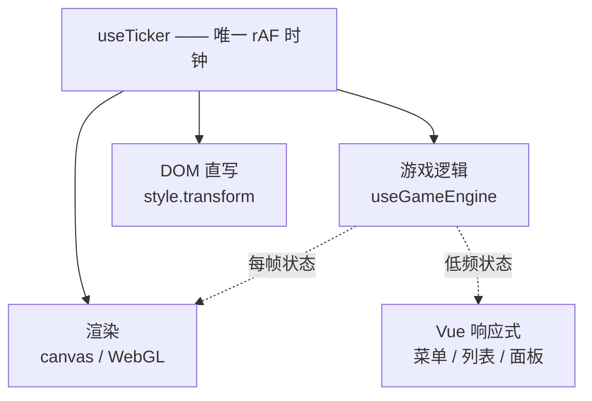

# Launchy Rhythm 前端渲染改造方案

> 交接文档。面向接手实现的人或模型。
> 目标：让 Electron 前端的游戏画面达到"游戏引擎"级别的流畅度与反馈感（2D，不需要 3D）。
> 读者前提：手上有仓库，能读代码，能跑 `npm run dev`。

---

## 0. 结论先行

**不要换运行时。** 本项目音频链路依赖 Web Audio 的三个原语：

| 需求 | Web Audio | Godot 等价物 |
|---|---|---|
| MP3/AAC/FLAC/OGG → 内存 PCM | `decodeAudioData()` | **不存在**（`AudioStreamMP3` 惰性解码，取不到 PCM） |
| 任意区间播放 `[a,b]` | `source.start(0, a, b - a)`，零拷贝 | **不存在**（只能 `seek()`，有接缝） |
| 采样级淡入淡出 | `AudioParam.linearRampToValueAtTime` | 只能 `_process` 里改音量 |
| 不漂移的音频时钟 | `AudioContext.currentTime` | `get_playback_position()` 块量化，官方文档承认会漂 |

其中 `AudioBufferSourceNode.start(when, offset, duration)` 是整个游戏状态机的基石，
`src/renderer/src/composables/useGameEngine.ts` 的每一次 `play()` / `playClip()` 都直接映射到它。

**要改的只是渲染层。** 具体做法见第 5 节。

---

## 1. 技术栈与文件地图

```
src/renderer/src/
├── App.vue                          # 视图切换；默认进 PlayerView
├── main.ts
├── assets/main.css                  # 约 2900 行，所有样式集中在这里
├── components/
│   ├── launchpad/LaunchpadGrid.vue  # 8×8 网格（游戏页 / 制谱器 / MIDI 测试台共用）
│   └── editor/WaveformEditor.vue    # 波形制谱器
├── composables/
│   ├── useTicker.ts                 # 全局 rAF 时钟（本次新增）
│   ├── useGameEngine.ts             # 游戏状态机（约 1300 行）
│   ├── useAudioEngine.ts            # Web Audio 解码与区间播放
│   ├── useMidiInput.ts              # 输入阈值 / 防抖
│   ├── usePlayfieldEffects.ts       # 光效参数（影响真实 Launchpad 灯光）
│   └── useProjects.ts               # 曲库与当前项目
└── views/
    ├── PlayerView.vue               # 摆摊用玩家界面（默认视图）
    ├── LibraryView.vue
    ├── EditorView.vue
    ├── GameView.vue                 # 开发者试玩页
    └── MidiDebugView.vue
```

运行：

```bash
npm run dev        # Electron + Vite，HMR 生效
npm run lint
npm run typecheck
npm run build
```

---

## 2. 问题诊断

### 2.1 现象

游戏画面"像网页"，缺少游戏特有的即时反馈与重量感。

### 2.2 根因（五条，均有代码证据）

#### ① 画面数据走 Vue 响应式热路径

`useGameEngine.ts` 每帧写 `activeNotes.value = new Set(...)`、`flashNotes.value = ...`。
这些 `ref` 触发 Vue 依赖追踪 → 组件重渲染 → VDOM diff → DOM patch。

**Vue 的响应式是为"数据偶尔变化时更新 UI"设计的，不是为"每帧更新 64 个视觉对象"设计的。**

#### ② 动画属性选错（合成 vs 重绘 vs 布局）

CSS 动画属性分三档：

| 档位 | 属性 | 代价 |
|---|---|---|
| 🟢 合成器 | `transform`, `opacity` | 不占主线程 |
| 🟡 重绘 | `background`, `box-shadow`, `border-color`, `color`, `filter` | 每帧重绘 |
| 🔴 布局 | `width`, `height`, `grid-template-columns`, `top/left` | 每帧整页重排 |

改造前存在大量 🟡 和 🔴。

#### ③ 计时器不对齐 vsync

改造前 `useGameEngine.ts` 有：

```ts
const EFFECT_FRAME_MS = 33
outerRingEffectTimer = window.setInterval(renderFrame, EFFECT_FRAME_MS)
rippleEffectTimer = window.setInterval(() => renderRippleFrame(token), EFFECT_FRAME_MS)
```

两个效果各一个 `setInterval(33ms)`：
- 不对齐显示器刷新（60Hz = 16.7ms，120Hz = 8.3ms）→ 视觉抖动
- 会被浏览器节流降频
- 两个 interval 相位互不相关 → 外圈流动和内圈射线永远不同步

#### ④ 缺少单一时间源

改造前同时存在六套时钟：两个 `setInterval(33)`、`setTimeout` 排程、
`requestAnimationFrame` 播放头、`setInterval(70)` 呼吸灯、CSS 动画自己的合成器时钟。

#### ⑤ 网页交互习惯

`.pad:hover { transform: translateY(-2px) }`、`:hover` 上浮等，是网页的 affordance，不是游戏的反馈语言。

---

## 3. 目标架构



**核心原则：每帧变化的东西不走 Vue 响应式，低频变化的东西继续用 Vue。**

分界线：

| 走 Vue（低频） | 不走 Vue（每帧） |
|---|---|
| 菜单、曲库、制谱器面板、按钮状态 | 8×8 网格、外圈流动、射线、粒子、屏幕震动 |
| 文本、统计数字 | pad 的缩放 / 颜色 / 光晕 |

### 时钟模型

所有每帧逻辑订阅 `onTick`，共享同一个 `now` 和 `dt`：

```ts
import { onTick } from './useTicker'

const stop = onTick((nowMs, dtMs) => {
  // 全部时间计算用 nowMs，不要用 performance.now() 重新取
})
```

`useTicker` 的规格：

- 单条 `requestAnimationFrame` 循环，订阅者为空时自动停止
- `dt` 上限 64ms（防止窗口从后台切回时动画瞬跳）
- 回调异常被捕获并 `console.error`，不打断其余订阅者
- 暴露 `tickerStats = { fps, subscribers, frameMs }` 供诊断

---

## 4. 已完成改动（当前工作区基线）

> ⚠️ 以下改动已在工作区，`npm run lint` / `typecheck` / `build` 均通过。
> 接手前先 `git status --short` 确认状态。

| 文件 | 改动 |
|---|---|
| `src/renderer/src/composables/useTicker.ts` | **新增**。全局 rAF 时钟 |
| `src/renderer/src/components/launchpad/LaunchpadGrid.vue` | **重写**。64 个 DOM `<button>` → 1 个 `<canvas>`；props/emits 接口不变；动画改为本地按帧推进 |
| `src/renderer/src/composables/useGameEngine.ts` | 两处 `setInterval(fn, 33)` → `onTick(fn)`；删除 `EFFECT_FRAME_MS`；`renderRippleFrame(token, now)` 接收 ticker 时间戳 |
| `src/renderer/src/assets/main.css` | 删除 `.pad` / `.pad-*`（已无对应 DOM），新增 `.pad-canvas`；`.player-stage` 移除 `grid-template-columns` 过渡；`.launchpad-console` 移除 `width` 过渡改为 `transform` 动画；`.real-pad` 移除 `background` / `box-shadow` 过渡与 `:hover` 上浮，`.pad-hit` 改为先胀后收的 `pad-impact` |

### 已验证

在真实 Chromium（非 headless）中确认：

- canvas 渲染 64 格，像素覆盖率约 47%，空闲底色采样为 `rgb(233,239,241)`
- 页面内 `.pad` 旧 DOM 节点数 = 0
- `tickerStats.fps` 报告 60 FPS
- 无 page error

### 未验证（接手后请优先确认）

- **命中动画的视觉效果没有端到端确认过。** `LaunchpadGrid.vue` 的 `trackTransitions()` 依赖 `flashNotes` / `errorNotes` 的边沿跳变来触发动画，逻辑上成立，但未在真实游戏流程中目视确认。
- 未接真实 Launchpad X 运行。

---

## 5. 待办工作项

### W1 — 消灭剩余的非合成属性动画

**目标**：全项目 CSS 动画只使用 `transform` 和 `opacity`。

**排查命令**：

```bash
grep -n "transition:\|animation:" src/renderer/src/assets/main.css
```

**已知待处理点**：

| 位置 | 现状 | 改法 |
|---|---|---|
| `main.css:885` `.track-option` | `transition: 0.2s`（全属性） | 只保留实际会变的合成属性 |
| `main.css:993-996` | `transition: transform, box-shadow, border-color` | 去掉 `box-shadow` / `border-color`，改为叠一层伪元素动 `opacity` |
| `main.css:2046-2049` | `transition: background, border-color, color` | 同上 |
| `main.css:795-806` `start-breathe` | 动 `opacity` **和** `filter: brightness()`；元素本身带 `box-shadow` | `filter` 会强制重新栅格化。改为叠一层白色/红色 `opacity` 遮罩做呼吸 |
| `main.css:828` `start-frame-breathe` | 动 `opacity`（可接受） | 保留 |

**验收**：DevTools Performance 录制菜单展开 / 呼吸动画，无 "Recalculate Style" 或 "Layout" 长任务；Rendering 面板勾选 "Paint flashing"，动画期间无大面积重绘。

---

### W2 — 热路径脱离 Vue 响应式

**目标**：`useGameEngine` 每帧产出的视觉状态，不经过 `ref` 触发组件重渲染。

**现状**：`useGameEngine` 暴露 `activeNotes` / `backgroundNotes` / `rippleNotes` / `flashNotes` / `errorNotes`，
均为 `ref<Set<number>>`，`GameView.vue` 作为 props 传给 `LaunchpadGrid`。

`LaunchpadGrid.vue` 内部已经是 canvas，所以触发成本已从"patch 64 个 DOM 节点"降到"传递 prop 引用"。
但 `ref` 的依赖追踪与组件重渲染仍在发生。

**做法（二选一）**：

**方案 A（推荐，改动小）**：在 `LaunchpadGrid.vue` 里不再声明这些 props，
改为接收一个**普通对象**句柄：

```ts
// useGameEngine.ts 内部维护普通对象，不放进 ref
const padState = {
  active: new Set<number>(),
  background: new Set<number>(),
  flash: new Set<number>(),
  error: new Set<number>(),
  revision: 0
}

// 组件通过 props 拿到这个对象的引用，在 ticker 里直接读
```

组件的 props 变成 `{ state: PadState }`，`frame()` 里直接读 `state.active`。
`revision` 只用于组件判断是否需要重绘（可选）。

**方案 B（改动大，更彻底）**：把 `useGameEngine` 的视觉输出与状态机彻底分离，
状态机只维护逻辑状态，视觉层订阅事件流。

**验收**：DevTools Performance 录制一局游戏，主线程脚本时间显著下降；
Vue DevTools 中 `LaunchpadGrid` 的渲染次数在游戏进行中不再随帧增长。

---

### W3 — 摆摊页（`PlayerView.vue`）的灯光时钟

**现状**：`PlayerView.vue:81`

```ts
breatheTimer = window.setInterval(() => { /* MIDI setPadsRgb */ }, 70)
```

**14Hz** 的灯光刷新，在实体 Launchpad 上会看到明显的阶跃。

**做法**：改用 `onTick`，并按 33ms 节流实际发送（LED 传输不需要每帧）：

```ts
let lastSend = 0
onTick((now) => {
  if (now - lastSend < 33) return
  lastSend = now
  // ...原有 setPadsRgb
})
```

**验收**：实体 Launchpad 上呼吸效果连续无阶跃；`tickerStats.frameMs` 不因灯光发送而升高。

---

### W4 — 游戏手感三件套

这三项与渲染无关，是**反馈设计**，但对"游戏感"的贡献大于任何渲染器升级。

#### W4.1 Hitstop（顿帧）

命中瞬间冻结视觉 2–4 帧（40–80ms），制造"命中很重"的错觉。

```ts
// useTicker 增加一个全局时间缩放
let hitstopUntil = 0
export function hitstop(ms: number): void {
  hitstopUntil = performance.now() + ms
}
// loop 内
const scaled = now < hitstopUntil ? 0 : dt
```

注意：**只冻结视觉，不冻结游戏逻辑与音频**。

#### W4.2 Squash & stretch（当前方向是错的）

改造前 `.real-pad.pad-hit { transform: scale(0.9) }` —— 按下时**缩小**，方向反了。

正确做法是**先胀后收**（已改为 `pad-impact` 关键帧，`LaunchpadGrid.vue` 的 canvas 版也已实现）：

```
0%   → scale(1.16, 0.86)   瞬间形变
55%  → scale(0.97, 1.03)   轻微过冲
100% → scale(1, 1)         回落
```

缓动用 `cubic-bezier(0.22, 1.4, 0.4, 1)`（带过冲的 ease-out-back）。

#### W4.3 音高随机化

`useAudioEngine.playClip()` 每次播放时给 `AudioBufferSourceNode.playbackRate`
加 ±5% 的随机偏移。避免连续同一 Pad 时的机械重复感。

**验收**：连按同一 Pad 十次，听觉上有轻微音高变化；视觉上命中反馈有明确的形变-回弹过程。

---

### W5 — 泛光与后处理（按需）

如果 canvas 2D 的发光（当前用 `globalCompositeOperation = 'lighter'` + 径向渐变）不够，
按以下顺序升级：

1. **先试 canvas 2D 加强**：多层径向渐变叠加 + 高斯近似的辉光扩散
2. **仍不够则引入 PixiJS v8**：
   - 只替换 `LaunchpadGrid.vue` 的内部实现，**props / emits 接口保持不变**
   - `pixi-filters` 的 `BloomFilter` 做全局泛光
   - `ParticleContainer` 做命中粒子（每个 pad 溅出 6–12 个，重力 + 淡出）
   - **复用 `app.ticker`，不要再开第二个 rAF 循环**
   - 生产环境用 WebGL 后端（官方明确建议：WebGPU 功能完整但浏览器实现不一致）

**门槛**：只有在"canvas 2D 已经用尽且视觉仍不达标"时才做这一步。8×8 网格 + 两种射线的复杂度，canvas 2D 通常够用。

---

### W6 — Electron 运行时调优

`src/main/index.ts`：

```ts
app.commandLine.appendSwitch('enable-gpu-rasterization')

new BrowserWindow({
  webPreferences: {
    backgroundThrottling: false
  }
})
```

**注意**：`backgroundThrottling: false` **已不能阻止后台 rAF 降频**（electron/electron#9567）。
要跑满 M 系列芯片的 ProMotion 刷新率，需要额外：

```ts
app.commandLine.appendSwitch('disable-frame-rate-limit')
```

代价是可能出现撕裂、GPU 占用升高。**先测量再决定是否启用。**

**验收**：`tickerStats.fps` 在 ProMotion 屏上稳定在 120。

---

## 6. 必须避免

| 反模式 | 为什么 |
|---|---|
| 新增 `setInterval` / `setTimeout` 驱动视觉 | 不对齐 vsync、会被节流。统一用 `onTick` |
| 用 CSS 过渡动画 `background` / `box-shadow` / `border-color` / `filter` | 每帧重绘 |
| 用 CSS 过渡动画 `width` / `height` / `grid-template-columns` / `top` / `left` | 每帧整页重排 |
| 每帧写 `ref` 驱动 64 个视觉对象 | 触发 Vue 响应式 + VDOM diff |
| 在 `onTick` 回调里做分配（`new Set`、数组 map、字符串拼接） | 每帧产生垃圾，GC 停顿会直接表现为掉帧 |
| `AudioBufferSourceNode` 的 `stop()` 后立即 `start()` 同一 buffer | 可以，但必须 `disconnect()` 旧节点（现有实现已处理） |

`onTick` 回调里应当只做：读状态 → 算数 → 写 `canvas` 或 `element.style.transform`。

---

## 7. 验收指标

| 指标 | 目标 | 测法 |
|---|---|---|
| 帧率 | 显示刷新率（60 或 120） | `tickerStats.fps` |
| 帧内脚本耗时 | < 2ms | `tickerStats.frameMs` |
| 长任务 | 游戏中无 > 50ms 的 Long Task | DevTools Performance |
| 布局抖动 | 动画期间无 Layout 记录 | DevTools Performance |
| 重绘范围 | 动画期间重绘限于变化的 pad | DevTools Rendering → Paint flashing |
| 输入→视觉反馈 | 同帧 | 按下到 pad 变色的帧数 |
| 输入→声音 | 不劣于改造前 | `AudioContext.baseLatency + outputLatency` 基线 |

音频输出延迟基线（写进文档备用）：

```ts
const ctx = getAudioContext()
console.log(ctx.baseLatency, ctx.outputLatency, ctx.sampleRate)
```

---

## 8. 选型备忘

评估过的替代方案与结论，避免重复讨论：

| 方案 | 结论 |
|---|---|
| **Electron + 现状（DOM/CSS）** | 已废弃。原因见第 2 节 |
| **Electron + Canvas（当前）** | ✅ 采用。64 个方块的规模够用，零新依赖 |
| **Electron + PixiJS** | 🟡 备选。仅当 canvas 2D 视觉上限不够时启用，见 W5 |
| **Electron + Phaser** | ❌ Phaser 自带游戏循环和场景图，会和 Vue 争夺控制权。且体积大 |
| **Godot 重构** | ❌ 音频退化：无区域播放原语、MP3 取不到 PCM、mix block 1024 帧（23ms）vs Web Audio 128 帧（2.9ms）、时钟会漂 |
| **Godot 预切片绕开** | 🟡 能解决 seek 接缝和解码，但**解决不了启动延迟与抖动**（那是 AudioServer 的结构问题） |
| **Godot + GDExtension 自研 AudioStreamPlayback** | ❌ 能解决区域播放与淡变，但延迟仍受 mix block 限制；且引入 ABI 版本矩阵与多平台预编译 |
| **Godot + FMOD** | ❌ 技术上匹配（`getDSPClock` / `setPosition(PCM)` / `CREATESAMPLE`），但 ① 本项目切片在构建时完全确定，用不上它的动态能力 ② Godot 4 集成（`utopia-rise/fmod-gdextension`）活跃度低、封装的是 Studio API 而非 Core API |
| **Electron + Godot 双进程** | ❌ 需要跨进程时钟同步（正是 Godot 原生音频的问题），且每个输入多两次 IPC 往返 |
| **Unity** | 🟡 音频上可行（`AudioSettings.dspTime` + `PlayScheduled` + `SetScheduledEndTime`），但需要重写状态机、重接 MIDI（MidiJack 只有 input，没有 output）、放弃已完成的制谱器 |

**关键判断**：Electron 缺的是渲染器（可以就地用 canvas / WebGL 补上），
Godot 缺的是音频原语（无法补回，或补回来的代价超过收益）。

---

## 9. 附录：点击路径

手动验证用：

| 界面 | 进入方式 |
|---|---|
| 摆摊玩家页（默认） | 启动即是 |
| 开发者外壳 | 点击右上角 `⌘` 按钮（`.developer-entry`） |
| 歌曲库 | 左侧导航「歌曲库」 |
| 制谱器 | 左侧导航「制谱器」 |
| 游戏页 | 左侧导航「开始游戏」 |
| MIDI 测试台 | 左下角「MIDI 测试台」（`.debug-link`） |

`LaunchpadGrid` 出现在游戏页、制谱器、MIDI 测试台三处，改一处三处生效。
MIDI 测试台不需要 Track 数据，是最快的目视验证入口。
