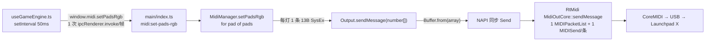

# MIDI 数据传输优化建议（温和版）

> 面向实现者（可用 GLM 执行）：本文只改「LED 数据怎么打包、怎么送、怎么节流」，
> **不改游戏状态机、不改音频、不改 UI 结构、不换 MIDI 库、不改 IPC 接口签名**。
>
> 依据：Novation _Launchpad X Programmer's Reference Manual_（官方 PDF）+
> 本仓库源码 + 本地 `@julusian/midi` 源码。所有引用行号以当前工作区为准。
>
> 状态：**建议稿，尚未实现**。

---

## 0. 现在的数据流



一帧外圈动画 = 28 条独立 SysEx = 28 次 `MIDISend`。

| 环节       | 现状                                              | 说明                            |
| ---------- | ------------------------------------------------- | ------------------------------- |
| 渲染侧 IPC | `setPadsRgb` 1 次 invoke/帧                       | 这条**已经**是批量的，不用改    |
| main → 灯  | **28 条消息/帧 ≈ 560 条/秒**                      | 主要问题                        |
| 单条成本   | 每次 `Buffer.from(number[])` 新分配               | `dist/output.js` 对数组每次转换 |
| 协议能力   | X 的 `0x03` 一条消息可带 **81 个 `<colourspec>`** | 当前只用了 1 个                 |

量级参考（**不可靠，勿作验收标准**：取自一次未授权的硬件测试，且当时 dev app 在跑）：
本机单次 `sendMessage` ≈ 1.8 µs；设备回读往返在 560 条/秒洪泛下仍稳定在 ≈ 2.2 ms。
→ 说明瓶颈不是带宽、也不是设备解析速度，而是**消息条数 × 进程/协议栈开销**。

---

## 1. 建议 1（优先）：一帧 = 一条 LED SysEx

### 协议依据

X 的 LED 灯光消息可以在一帧里重复 `<colourspec>`：

```
F0 00 20 29 02 0C 03 <colourspec> [<colourspec> ...] F7
```

- 每条 `<colourspec>` = `type(1B) + LED索引(1B) + 数据(1~3B)`
- `type 0` 调色板静态（1B）、`1` 闪烁（2B）、`2` 脉冲（1B）、`3` **RGB（3B，文档规定 0–127）**
- **一条消息最多 81 条 `<colourspec>`**（可覆盖整面）

字节数：

| 场景           | 条目 | 消息长度                         |
| -------------- | ---- | -------------------------------- |
| 外圈 28 灯 RGB | 28   | `7 + 28×5 + 1 = 148` B，**1 条** |
| 整块 8×8 RGB   | 64   | `7 + 64×5 + 1 = 328` B，**1 条** |
| 理论上限       | 81   | `7 + 81×5 + 1 = 413` B，**1 条** |

> 注意：`<colourspec>` 每条**自带 type 字节**，所以是 5 B/灯，不是 4 B/灯。

### 目标实现（`src/main/midi/midi-manager.ts`）

不改任何对外签名：`setPadsRgb(request: PadRgbBatchRequest)` 保持原样，
`preload` / `shared/midi.ts` / IPC channel **全部不动**。

```ts
const SYSEX_HEADER = [0xf0, 0x00, 0x20, 0x29, 0x02, 0x0c] // X 的固定头
const CMD_LED_LIGHTING = 0x03
const COLOURSPEC_RGB = 0x03
const MAX_COLOURSPECS = 81
const BYTES_PER_RGB_SPEC = 5
const FRAME_PREFIX = SYSEX_HEADER.length + 1 // 7
// 7 + 81*5 + 1 = 413
const FRAME_BUFFER_SIZE = FRAME_PREFIX + MAX_COLOURSPECS * BYTES_PER_RGB_SPEC + 1

export class MidiManager {
  // 复用同一块内存，避免每帧分配
  private readonly ledFrame = Buffer.allocUnsafe(FRAME_BUFFER_SIZE)

  setPadsRgb(request: PadRgbBatchRequest): { ok: boolean; error?: string } {
    if (!this.output || !this.connection.connected) {
      return { ok: false, error: '尚未连接 MIDI 输出端口' }
    }

    // 同一 note 后者覆盖前者（设备本来就是后写生效，去重只是省字节）
    const byNote = new Map<number, PadRgbRequest>()
    for (const pad of request.pads) byNote.set(this.clamp(pad.note, 0, 127), pad)
    const pads = [...byNote.values()]
    if (!pads.length) return { ok: true }

    try {
      for (let offset = 0; offset < pads.length; offset += MAX_COLOURSPECS) {
        const chunk = pads.slice(offset, offset + MAX_COLOURSPECS)
        const length = this.writeLedFrame(chunk)
        // subarray 是零拷贝视图；@julusian/midi 对 Buffer 不再做 Buffer.from
        this.output.sendMessage(this.ledFrame.subarray(0, length))
      }
      return { ok: true }
    } catch (error) {
      return { ok: false, error: this.errorMessage(error) }
    }
  }

  /** 把一帧写入复用缓冲，返回有效长度 */
  private writeLedFrame(pads: PadRgbRequest[]): number {
    const buffer = this.ledFrame
    let i = 0
    for (const byte of SYSEX_HEADER) buffer[i++] = byte
    buffer[i++] = CMD_LED_LIGHTING

    for (const pad of pads) {
      buffer[i++] = COLOURSPEC_RGB
      buffer[i++] = this.clamp(pad.note, 0, 127)
      buffer[i++] = this.clampRgb(pad.red)
      buffer[i++] = this.clampRgb(pad.green)
      buffer[i++] = this.clampRgb(pad.blue)
    }

    buffer[i++] = 0xf7
    return i
  }
}
```

要点：

- `sendMessage` 是**同步**的（native 调用内部就完成了 packet list 拷贝），所以下一帧复用同一
  块 Buffer 安全，不需要双缓冲。
- 超过 81 条才分片（外圈 28 + 6×6 内圈 36 = 64，正常永远 1 条）。
- `setPadRgb`（单灯）可以保留给调试台/单灯场景；也能内部转调 `setPadsRgb({pads:[...]})`。
- 不要用 X 上的 `0x02 00`「清屏」命令：它**不在官方命令表**里（Apollo 用了，但属未登记命令）。
  清屏用一批 `type 0 / 调色板 0` 的 colourspec 即可（见建议 5）。

### 预期收益

| 指标                       | 现状    | 之后      |
| -------------------------- | ------- | --------- |
| 消息数/帧                  | 28      | 1         |
| 消息数/秒 @20Hz            | 560     | 20        |
| MIDI 字节/帧               | 364     | 148       |
| USB-MIDI 线上字节/秒 @20Hz | ≈ 2,800 | ≈ 1,000   |
| `Buffer` 分配/帧           | 28      | 0（复用） |

### 验收

**无硬件**：临时脚本（一次性，跑完删掉）验证打包字节。例：

```ts
// 输入
{ pads: [ {note:11, red:255, green:0, blue:0}, {note:12, red:0, green:255, blue:255} ] }
// 期望（注意 255→127 = 0x7F）
F0 00 20 29 02 0C 03 | 03 0B 7F 00 00 | 03 0C 00 7F 7F | F7
```

**有硬件（需你本人在场、且先断开 dev app）**：整圈动画/渐变/绿闪/红闪/错误提示目测无变化，
外圈流动的“蓝底白峰”仍然连续。

---

## 2. 建议 2：消除每帧分配

与建议 1 一起完成：

- 上面已用 `Buffer.allocUnsafe` 复用缓冲。
- **传 `Buffer` 而不是 `number[]`**：`dist/output.js` 里对数组会走 `Buffer.from(message)`，
  对 `Buffer` 直接透传，少一次拷贝。
- `Buffer.subarray()` 每帧只产生 1 个视图对象，可忽略。

验收：`grep` 确认热路径（动画相关）不再出现 `number[]` 形式的 `sendMessage`。

---

## 3. 建议 3：统一颜色数值语义为 0–255（会变亮，需要重调常量）

### 问题

现在渲染侧是**两套语义混用**，main 又按 Launchpad **MK2 的 0–63** 截断：

- `midi-manager.ts:110-112`（`setPadRgb`）：`clamp(red, 0, 63)`（`setPadsRgb` 走同一路径，`:117-121`）
- `useGameEngine.ts:898` `scaleColor`：`(value / 255) * 63`
- 但大量直接调用点写的是 **0–63 / 0–127 空间**的常量（见下表）
- X 的文档规定 RGB 是 **0–127**

结果：所有颜色**最亮只有约一半**，且相对比例被压扁
（例：`PLAYFIELD_NOTE_COLOR = {0,205,225}` 经 `scaleColor` → `{0,51,56}`，再 clamp 后仍是半亮度）。

### 目标

1. **约定：渲染侧一律 0–255**（和 `#rrggbb` 一致）；main 在 `setPadRgb`/`setPadsRgb` 边界统一映射：

   ```ts
   private clampRgb(value: number): number {
     return Math.min(127, Math.max(0, Math.round((value / 255) * 127)))
   }
   ```

2. `scaleColor`（`useGameEngine.ts:898-900`）退化为「clamp 到 0–255」，不再做 63 缩放。
3. 把 0–63 / 0–127 空间的常量改成等价的 0–255 值（×4 / ×2，机械替换）：

| 位置                                                                 | 现值（原语义）               | 改为（0–255）               |
| -------------------------------------------------------------------- | ---------------------------- | --------------------------- |
| `useGameEngine.ts:26` `OUTER_RING_BASE_COLOR`                        | `{3,12,45}` (63)             | `{12,48,180}`               |
| `useGameEngine.ts:531,581` 渐亮终点 `sendOuterRingColor({45,55,63})` | (63)                         | `{180,220,252}`             |
| `useGameEngine.ts:562-564` 渐亮插值                                  | `3+42e, 12+43e, 42+21e` (63) | `12+168e, 48+172e, 168+84e` |
| `useGameEngine.ts:618-620` 流动脉冲                                  | `10+53p, 20+43p, 55+8p` (63) | `40+212p, 80+172p, 220+32p` |
| `useGameEngine.ts:209` 命中绿闪                                      | `{0,63,0}` (63)              | `{0,255,0}`                 |
| `useGameEngine.ts:775` flashStep 绿闪                                | `{0,63,0}` (63)              | `{0,255,0}`                 |
| `useGameEngine.ts:676,689` 错误红闪                                  | `{127,0,0}` (127)            | `{255,0,0}`                 |
| `useGameEngine.ts:678` 期望提示橙                                    | `{127,40,0}` (127)           | `{255,80,0}`                |
| `useGameEngine.ts:18` `PLAYFIELD_NOTE_COLOR`                         | `{0,205,225}` (255)          | **不变**                    |
| `useGameEngine.ts:759` 外圈 play 边界                                | `{12,44,255}` (255)          | **不变**                    |

（×4 之后范围是 0–252，不是 0–255；这对 7 bit 输入只有 ±1 级差异，可接受。）

### 注意

- 这一步**会明显变亮**，属于观感变更：实现后需要你目测一遍所有灯效，必要时单独微调上表数值。
- 设备端 RGB 输入是 7 bit，但 LED 硬件有效分辨率更低（6 bit/通道），所以 0–63 其实已经接近
  硬件极限 —— **这一步不是为了更细的层次，而是为了不再被半亮度截断**。
  （“LED 是 6 bit”来自 Apollo 作者的博客，非 Novation 文档，标记为待验证。）
- 与建议 5 有耦合：`lightNotes` 里的 `scaleColor` 调用点会一起改，**建议 3 和 5 一起做**。

### 验收

无硬件：断言 `clampRgb(255) === 127`、`clampRgb(0) === 0`、`clampRgb(63) === 31`。
有硬件：目测各灯效亮度/颜色符合预期，无过曝（如果过曝就调整动画常量，而不是退回 0–63）。

---

## 4. 建议 4：帧节流（latest-wins），可选升到 30 Hz

现状：`useGameEngine.ts:609-628`（外圈流动）、`useGameEngine.ts:535-566`（渐亮）
用 `setInterval(renderFrame, 50)`，**没有丢帧策略**：渲染慢或 IPC 慢时，回调会排队补帧，
越积越旧。

温和改法（不改动画数学）：

```ts
let frameInFlight = false

const renderFrame = (): void => {
  if (frameInFlight) return // 上一次还没回来，本帧直接跳过
  frameInFlight = true
  void window.midi.setPadsRgb({ pads: buildFrame(elapsedMs) }).finally(() => {
    frameInFlight = false
  })
}
```

之所以安全：**每一帧送的都是绝对状态快照**（28 个灯的完整颜色），跳过一帧不会丢状态，
下一帧会覆盖。这也是 Apollo 的做法（信号聚合到一帧，帧率上限默认 150，可调）。

可选：`OUTER_EFFECT_FRAME_MS` 由 `50` 改 `33`（30 Hz），流动脉冲的视觉台阶会明显减少。
改动前先确认 420 ms 的流动时长观感仍然合适。不要在此同时引入
`requestAnimationFrame` 或 `setTimeout` 漂移补偿，那是另一个量级的改动。

验收：连续触发命中（快速连打）时不再出现灯效“追帧式”延迟；掉帧时后续帧不补发旧状态。

---

## 5. 建议 5：把「循环逐灯 `setPadRgb`」的调用点改成一次批量

这些调用点当前是 N 次 IPC + N 条 SysEx，改成收集数组后一次 `setPadsRgb`：

| 位置                                           | 现状                       | 备注                                                    |
| ---------------------------------------------- | -------------------------- | ------------------------------------------------------- |
| `useGameEngine.ts:839-851` `lightNotes()`      | 每个 note 一次 `setPadRgb` | **收益最大**：`showPlayfield` 会一次点 28 外圈 + N 内圈 |
| `useGameEngine.ts:751-762` `showPlayfield()`   | 28 + Σ(steps) 次           | 经 `lightNotes` 一次性批量                              |
| `useGameEngine.ts:769-778` `flashStep()`       | 每 pad 一次                | 改为 1 次                                               |
| `useGameEngine.ts:676-679` 失败提示（红 + 橙） | 1 + N 次                   | 改为 1 次                                               |
| `useGameEngine.ts:689` 单灯红闪                | 1 次                       | 保持单灯即可                                            |
| `useGameEngine.ts:209` 命中绿闪                | 1 次                       | 保持单灯即可                                            |
| `midi-manager.ts:130` `clearLaunchpad()`       | **64 条** Note On          | 改为 1 条 SysEx：64 个 `type 0`（调色板 0）条目         |

`sendOuterRingColor()`（`useGameEngine.ts:853-857`）已经在用 `setPadsRgb`，只需跟随建议 3 改常量。

验收：DevTools 里统计一帧的 `midi:set-pads-rgb` invoke 次数 ≤ 1–2；
`clearLaunchpad` 只发 1 条消息。

---

## 6. 建议 6：让「发送失败」可见（温和版，不做自动重连）

### 问题（已在本地源码确认）

- `MidiOutCore::sendMessage` 里 `MIDISend` 失败 → `error(RtMidiError::WARNING, …)`
- `MidiApi::error()`（`vendor/rtmidi/RtMidi.cpp:759-786`）在没有 errorCallback 时
  **只往 stderr 打印，永不抛出**
- 绑定层**没有注册任何 errorCallback**（`src-cpp/` 全目录无 `setErrorCallback`）

所以：**设备掉线、端口失效期间的 LED 写入是静默丢弃的，`send()` 仍返回 `{ ok: true }`。**
这会让“偶尔不亮/不稳”无法排查。

温和做法（二选一或都做）：

1. **健康探测**：main 暴露 `midi:probe`，发送一条只读 readback
   （`F0 00 20 29 02 0C 00 F7` = 读取当前 layout），在 300 ms 内收到设备回包即视为存活。
   渲染侧仅在断线怀疑时调用；不要在动画热路径里调用。
2. **心跳时间戳**：main 记录 `lastSendAt = Date.now()`，`midi:get-ports` 或新增
   `midi:health` 返回 `{ connected, lastSendAt }` 供 UI 展示。

明确**不做**：自动重连、100 ms 端口重扫（Apollo 的做法）——那属于连接层重构，另开一轮。
另外 `getPorts()` 每次调用都 `new Input()/new Output()` 再 destroy（`midi-manager.ts`），
可顺手改成缓存实例，但优先级最低。

验收：拔掉设备后，UI/控制台能明确提示“LED 发送失败/设备已离线”，而不是静默无灯。

---

## 7. 明确不建议做的事

| 不做                                                        | 原因                                                                                                                                                     |
| ----------------------------------------------------------- | -------------------------------------------------------------------------------------------------------------------------------------------------------- |
| 换 MIDI 库（easymidi / jzz / jazz-midi / 原版 `midi`）      | 同为「一次调用一条消息」的同步原生路径，没有批量能力；原版 `midi` 是 NAN，Electron 30+ 重建失败；jzz/jazz-midi 有 macOS + Electron 下 SysEx 不送达的记录 |
| 走虚拟 MIDI 端口                                            | 多一跳，且 RtMidi 有 macOS 虚拟端口 SysEx 未送达的未修 bug（thestk/rtmidi#366）                                                                          |
| 用 `F0 5F` 压缩批量格式                                     | 只有刷过第三方固件的机器认；原厂 X 会忽略                                                                                                                |
| 用 `0x02 00` 清屏                                           | 不在 X 的官方命令表里（虽然 Apollo 对 X 用了）                                                                                                           |
| 改设备配置（LED feedback `0x0A`、触后 `0x0B`、亮度 `0x08`） | 会改变整机行为（例如关闭 external feedback 会让 Note/CC 调色板点灯失效），必须单独验证，别混在传输优化里                                                 |
| 把 LED 输出搬到 renderer Web MIDI 或子进程                  | 本阶段无收益（macOS 上 `MIDISend` 是 realtime-safe 的异步入队），会引入第二套端口/时间戳语义                                                             |
| 动 `setPadPalette` 调色板路径                               | 与本次问题无关，保持不动                                                                                                                                 |

---

## 8. 实施顺序与验收

按「收益 ÷ 风险」排序，每一步都可独立提交、独立回滚：

| 顺序 | 内容                                                                          | 建议一起做       |
| ---- | ----------------------------------------------------------------------------- | ---------------- |
| 1    | 建议 1 + 2：一帧一条 SysEx + Buffer 复用                                      | ← 一起           |
| 2    | 建议 5 + 3：调用点批量 + 颜色语义统一                                         | ← 一起（有耦合） |
| 3    | 建议 6：发送失败可见性                                                        | 独立             |
| 4    | 建议 4：帧节流 + 可选 30 Hz                                                   | 独立             |
| 5    | 可选清理：`clearLaunchpad` 单消息、输入侧过滤触后/时钟、`getPorts()` 缓存实例 | 独立             |

每步完成后统一跑：

```bash
npm run lint
npm run typecheck   # 或 npm run build
```

硬件验证（需要你同意、且先断开其他占用端口的程序）：

1. 连接 → 进 Programmer mode → 清屏正常；
2. 外圈渐亮、Reveal、命中绿闪、错误红闪、流动脉冲逐项目测；
3. 快速连打不同 Pad，确认无追帧式延迟；
4. 若做了建议 3，逐色对比亮度/饱和度是否过曝。

---

## 9. 待验证 / 留到以后

- **X 的 LED 刷新率上限**：Novation 官方文档没有给（已核对 X PDF + User Guide、Mini MK3、
  LPP3、MK2、初代 Pro 及 KB）。所以“20 Hz 够不够、30 Hz 是否可见提升”只能实测。
- **RGB 有效分辨率是否为 6 bit/通道**（来自 Apollo 作者博客，非官方文档）。
- **是否值得把 LED 帧循环搬到 main 进程**（渲染进程只发目标状态）：只有在建议 1–4 做完后
  仍觉不够时才考虑，属于结构改动，不在本文范围。
- **输入侧**：`connect()` 目前 `ignoreTypes(false, false, false)`，且 `main/index.ts` 把
  **每一条** 输入消息广播给所有窗口。若以后开启触后（设备默认 `type=2` 关闭），
  建议在 main 过滤掉 `0xA0/0xD0` 与 `0xF8–0xFE` 再广播。
  另外 `useMidiInput.ts:59-72` 的防抖只记住“上一个被接受的 Pad”，
  A→B→A 快速连打不会被拦截；更稳的做法是维护“当前按下的 Pad 集合”
  （Note On 置位、Note Off 清位）。这两项都不改协议，可作为后续小改。
